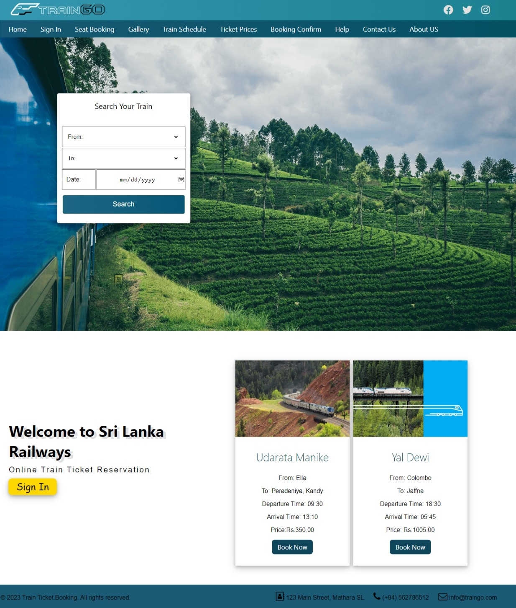

# TrainGo - Web-based Train Reservation System

Welcome to TrainGo, a web-based train reservation system developed as part of our university group project! This system allows users to easily search for train routes, check availability, and make reservations hassle-free.

## Features

- **User-Friendly Interface:** TrainGo offers an intuitive and user-friendly interface, making it easy for users to navigate and book train tickets.

- **Real-Time Train Information:** Get access to real-time train information, including schedules, seat availability, and ticket prices.

- **Secure and Reliable:** Rest assured that your personal and payment information is safe and secure with our robust data protection measures.

- **Responsive Design:** TrainGo is fully responsive, ensuring a seamless user experience across various devices, including large screens.

## Screenshots

## Live Demo

Experience TrainGo live by visiting [here](https://pathugit.github.io/TrainGo-website/).

## Installation

To run TrainGo locally, follow these steps:

1. Clone the repository: `git clone https://github.com/your-username/train-go.git`
2. Navigate to the project directory: `cd train-go`
3. Open `index.html` in your preferred web browser.

## Feedback

Your feedback and suggestions are valuable to us. If you encounter any issues or have ideas for improvements, please open an issue on the GitHub repository.

## License

TrainGo is licensed under the [MIT License](LICENSE).
